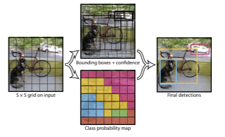
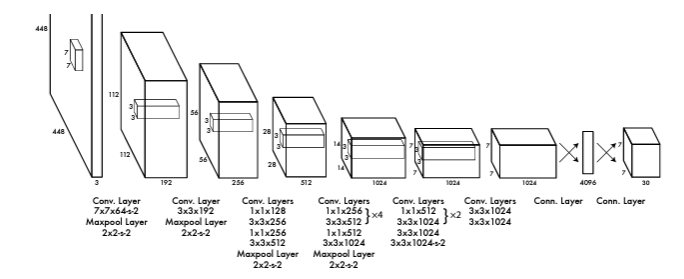

[YOLO 논문](https://www.cv-foundation.org/openaccess/content_cvpr_2016/papers/Redmon_You_Only_Look_CVPR_2016_paper.pdf) 

YOLO(You Only Look Once)는 2015년에 제안된 Object Detection 알고리즘이다. 기존의 Object Detection 알고리즘들은 이미지를 여러 개의 그리드로 나누고, 각 그리드마다 Object가 있는지 없는지를 판단하는 방식으로 동작한다. 이러한 방식은 이미지를 여러 개의 그리드로 나누기 때문에 속도가 느리다는 단점이 있다. 이러한 단점을 보완하기 위해 제안된 것이 YOLO이다. YOLO는 이미지를 여러 개의 그리드로 나누는 것이 아니라 이미지를 한 번에 통째로 입력으로 받는다. 이렇게 이미지를 한 번에 통째로 입력으로 받기 때문에 기존의 Object Detection 알고리즘들보다 속도가 빠르다는 장점이 있다. 또한, YOLO는 이미지를 한 번에 통째로 입력으로 받기 때문에 이미지의 전체적인 정보를 고려할 수 있다는 장점이 있다. 이러한 장점들을 가지고 있기 때문에 YOLO는 기존의 Object Detection 알고리즘들보다 더욱 정확한 Object Detection을 할 수 있다. 또한 기존의 Object detection을 regression 으로 관점을 바꾸어서 해결하였다.

## One stage Detection vs Two stage Detection
Object Detection 알고리즘은 크게 One stage Detection과 Two stage Detection으로 나눌 수 있다. One stage Detection은 이미지를 한 번에 통째로 입력으로 받는 방식이다. 입력을 받으면서 Localization 과 Classification을 동시에 수행한다. 그렇기때문에 One stage Detection은 속도가 빠르다는 장점이 있다. Two stage Detection은 이미지를 여러 개의 그리드로 나누는 방식이다. 입력을 받으면서 Localization을 수행하고, Classification은 나중에 따로 수행한다. 그렇기 때문에 Two stage Detection은 속도가 느리다는 단점이 있다. 그러나 Two stage Detection은 Localization과 Classification을 따로 수행하기 때문에 정확도가 높다는 장점이 있다. YOLO 모델은 One stage Detection 알고리즘이다.

## Unified Detection
  

YOLO 모델은 물체를 detection 하기 위해 두 가지 단계로 나뉘게 된다. 
1. 이미지를 SxS 그리드로 나눈다.    
2. 각 그리드마다 B개의 bounding box를 예측한다.
3. 각 bounding box마다 C개의 클래스에 대한 확률을 예측한다.

각 Boundding box는 5개의 정보를 가지고 있다.
1. (x,y) : 그리드의 왼쪽 상단을 기준으로 bounding box의 중심 좌표
2. w,h : bounding box의 너비와 높이( 전체 이미지의 너비와 높이로 각각 나눠주기 때문에 0~1 사이의 값을 가짐)
3. confidence score : bounding box에 물체가 있을 확률
4. class probabilities : bounding box에 물체가 있을 확률

### IOU(Intersection over Union)
IOU는 두 개의 bounding box가 얼마나 겹치는지를 나타내는 지표이다. IOU는 0~1 사이의 값을 가지며, 1에 가까울수록 두 개의 bounding box가 많이 겹친다는 의미이다. YOLO는 confidence prediction을 위해 아래와 같이 사용한다.  
$$ Pr(Class_i|Object) * Pr(Object) * IOU^{truth}_{pred} = Pr(Class_i) * IOU^{truth}_{pred} $$  
 위의 식에서 $ Pr(Class_i|Object) $ 는 bounding box에 물체가 있을 확률이고, $ Pr(Object) $ 는 그리드에 물체가 있을 확률이다. $ IOU^{truth}_{pred} $ 는 ground truth와 예측한 bounding box의 IOU이다. 위의 식을 보면 bounding box에 물체가 있을 확률과 그리드에 물체가 있을 확률을 곱한 값이 bounding box에 물체가 있을 확률과 ground truth와 예측한 bounding box의 IOU를 곱한 값과 같다는 것을 알 수 있다. 이러한 식을 통해 YOLO는 confidence prediction을 수행한다.

## Network Design
 
YOLO는 기본적으로 GoogLeNet 기반으로 만들어졌다. 24개의 Convolution layer와 2개의 Fully Connected layer로 구성되어 있다. 이 중에서 특별한 점은 1 X 1 Reduction layer 을 사용한 것이다.

### 1 X 1 Reduction layer
1 X 1 Reduction layer는 1 X 1 Convolution layer를 말한다. 1 X 1 Convolution layer는 입력으로 받은 feature map의 채널 수를 줄이는 역할을 한다. 1 X 1 Convolution layer는 입력으로 받은 feature map의 채널 수를 줄이기 때문에, 연산량을 줄이는 효과가 있다. 또한, 1 X 1 Convolution layer는 입력으로 받은 feature map의 채널 수를 줄이기 때문에, feature map의 크기를 줄이는 효과가 있다. 이러한 특징을 가지고 있기 때문에 1 X 1 Convolution layer는 연산량을 줄이면서도 feature map의 크기를 줄이는 효과를 가지고 있다. 이러한 특징을 가지고 있기 때문에 YOLO는 1 X 1 Reduction layer를 사용하였다.

## Training
YOLO 는 ImageNet 데이터셋으로 사전 훈련된 모델을 사용한다. 그리고 이 사전 훈련된 모델을 Pascal VOC 데이터셋으로 fine tuning 한다. YOLO는 224 X 224 크기의 이미지를 입력으로 받는다. 그리고 이 이미지를 448 X 448 크기로 늘려서 입력으로 받는다. 이렇게 이미지를 늘리는 이유는 이미지의 크기를 늘리면서 이미지의 정보를 늘리기 위해서이다. YOLO는 224 X 224 크기의 이미지를 입력으로 받기 때문에, 448 X 448 크기의 이미지를 입력으로 받으면 이미지의 정보를 늘릴 수 있다. 이렇게 이미지의 정보를 늘리면서 fine tuning을 하면 더욱 더 정확한 Object Detection을 할 수 있다.   

### activation function
YOLO는 activation function으로 Leaky ReLU를 사용한다. Leaky ReLU는 ReLU의 변형된 버전이다. ReLU는 입력으로 받은 값이 0보다 작으면 0을 출력하고, 0보다 크면 입력으로 받은 값을 그대로 출력한다. 이 때 입력으로 받은 값이 0보다 작으면 0을 출력하기 때문에, ReLU는 dying ReLU 문제가 발생할 수 있다. dying ReLU 문제는 입력으로 받은 값이 0보다 작으면 0을 출력하기 때문에, 그 다음에 오는 뉴런들에게 0을 전달하게 된다. 이러한 현상이 반복되면서 뉴런들이 죽게 되는 현상이다. 이러한 문제를 해결하기 위해 제안된 것이 Leaky ReLU이다. Leaky ReLU는 입력으로 받은 값이 0보다 작으면 0.1을 곱한 값을 출력하고, 0보다 크면 입력으로 받은 값을 그대로 출력한다. 이 때 입력으로 받은 값이 0보다 작으면 0.1을 곱한 값을 출력하기 때문에, dying ReLU 문제를 해결할 수 있다. 이러한 특징을 가지고 있기 때문에 YOLO는 Leaky ReLU를 사용하였다.

### loss function
YOLO는 loss function으로 SSE(Sum of Squared Error)를 사용한다. 이 것은 optimization을 하기에는 좋으나, classification error으로 인해 localization error이 발생하고, 이로 인해 model을 조기 종료시키게 될 수도 있다. 이를 위해 YOLO는 bounding box 좌표 예측에서 발생하는 손실을 늘리고, Object가 포함되지 않은 bounding box의 confidence score을 줄여서 해결했다.   
Multi-part loss function은 아래와 같다.
$$ \lambda_{coord} \sum_{i=0}^{S^2} \sum_{j=0}^{B} \mathbb{1}_{ij}^{obj} [(x_i - \hat{x_i})^2 + (y_i - \hat{y_i})^2] + \lambda_{coord} \sum_{i=0}^{S^2} \sum_{j=0}^{B} \mathbb{1}_{ij}^{obj} [(\sqrt{w_i} - \sqrt{\hat{w_i}})^2 +(\sqrt{h_i} - \sqrt{\hat{h_i}})^2] $$ 
$$+ \sum_{i=0}^{S^2} \sum_{j=0}^{B} \mathbb{1}_{ij}^{obj} (C_i - \hat{C_i})^2 + \lambda_{noobj} \sum_{i=0}^{S^2} \sum_{j=0}^{B} \mathbb{1}_{ij}^{noobj} (C_i - \hat{C_i})^2 + \sum_{i=0}^{S^2} \mathbb{1}_{i}^{obj} \sum_{c \in classes} (p_i(c) - \hat{p_i}(c))^2 $$

## Limitations
YOLO는 이미지를 한 번에 통째로 입력으로 받기 때문에, 이미지의 전체적인 정보를 고려할 수 있다는 장점이 있다. 그리고 이미지를 한 번에 통째로 입력으로 받기 때문에, 기존의 Object Detection 알고리즘들보다 속도가 빠르다는 장점이 있다. 그러나 YOLO는 이미지를 한 번에 통째로 입력으로 받기 때문에, 이미지의 전체적인 정보를 고려할 수 있지만, 이미지의 전체적인 정보를 고려하기 때문에 작은 물체를 잘 찾지 못한다는 단점이 있다. 또한, YOLO는 이미지를 한 번에 통째로 입력으로 받기 때문에, 기존의 Object Detection 알고리즘들보다 속도가 빠르지만, 이미지를 한 번에 통째로 입력으로 받기 때문에, 이미지의 전체적인 정보를 고려하기 때문에 속도가 빠르면서도 정확도가 높지는 않다는 단점이 있다.

